# basics-of-AI-and-ML
This presentation provides an overview of Machine Learning, including its history, types, algorithms, and applications. It covers topics such as supervised and unsupervised learning,linear regression, classification, clustering,  model selection, evaluation, and deployment.

 This repo is a great resource for beginners and experienced practitioners alike to learn about this important field.
 
 this presentation created using a platform called marp check https://github.com/marp-team/marp
 
 ### Created by Ahmadreza Anaami

---

## **AI**: From the pages of *science*, to the future of our **lives**.
### by `Ahmadreza` Anaami

<!-- 
_class: invert 

_header: In the name of who surround me with blessing that I can not count 

-->

---

# Goals

### In this **lab** you will:

* have a brief introduction on *AI* and *ML*
    * basic concept of machine learning
* main algorithm 
    * supervised
        * `regression`
        * classification
    * unsupervised 
* Learn to implement linear `regression`

<!-- 
_backgroundColor: black
_class: invert
-->

---
<!-- 
_class: invert
_paginate: false
-->
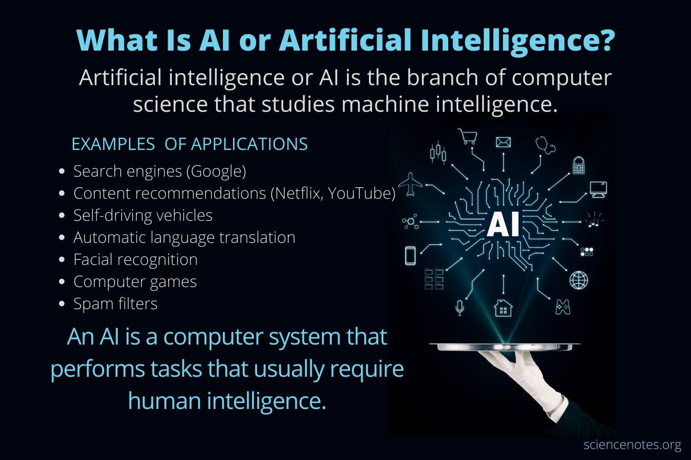

---
## machine learning 

Subfield of AI in order to make intelligent machine
<!-- 
_class: invert 
_backgroundColor: navy
-->

> Field of study that gives the computers the ability to learn without `explicitly` programmed

- Arthur samuel `1959`

----
<!-- 

-->

# Supervised learning

- learn from being given **right answers**
    - correct pairs of input (x) and output (y)

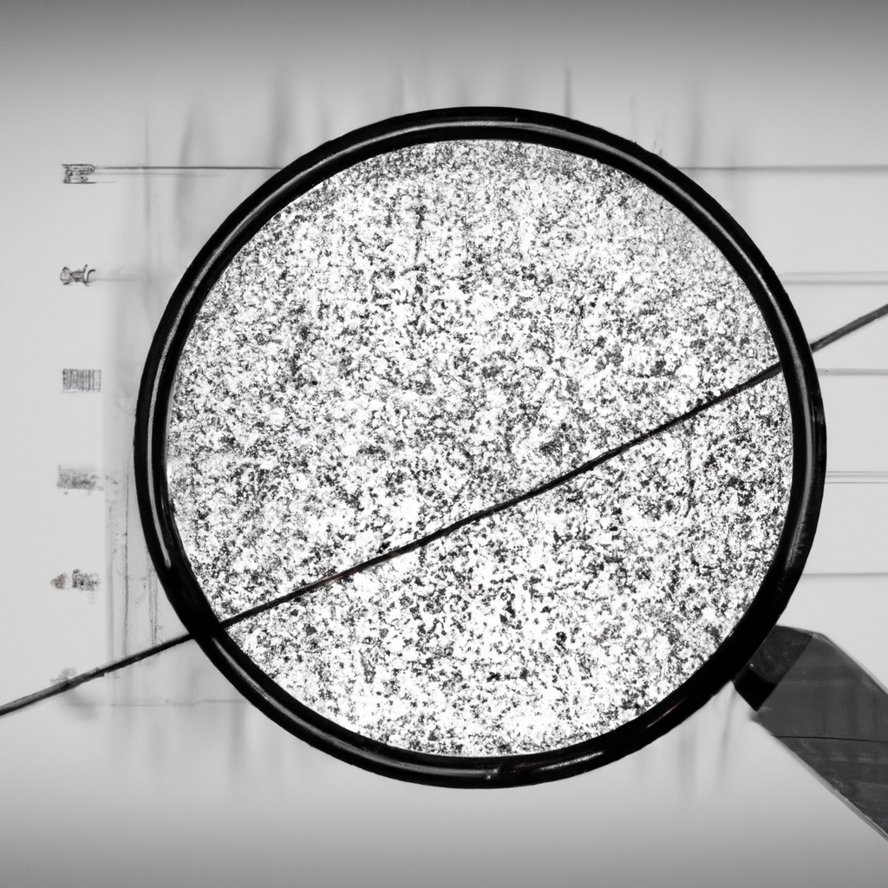

---

| *input*     | *output* |  *application*  |
| --------| --------- |----------------- |
| email              | spam?(0,1)             ||
| audio               | text transcript                      ||
| English              | Spanish             ||
| ad-User               | click?(0,1)                      ||
| image-radar              | position of other car            ||
| image of phone               | defect?(0,1)                    ||

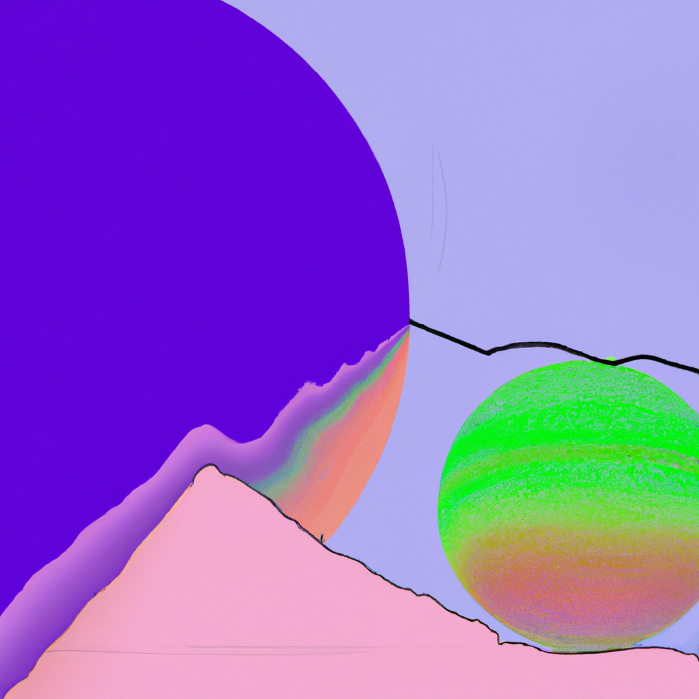

<!-- 
_class: invert
_paginate: false
-->

---

## Regression
predict a `number` from 
infinitely many possible `outputs`
<!-- 
_color: green
-->

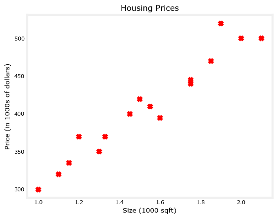

---

# Classification

many `inputs` 
some outputs called `categories` 

| *Size*     | *diagnosis* |
| --------| --------- |
| 6              | 1             |
| 8              | 1             |
| 2              | 0             |
| 5               | 0                      |
| 1              | 0          |
| 7               | 1                     |
| 5.6              | 1           |
| 12              | 1                   |
| 3.5              | 0             |

<!-- 
_class: invert
_paginate: false
_backgroundColor: black
-->
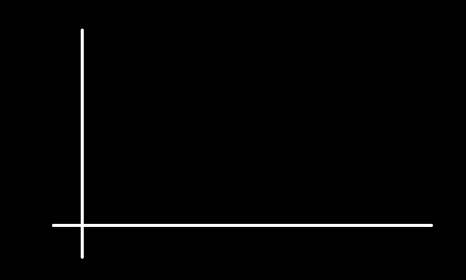

---

---

# <!--fit-->Recap
<!-- 
_class: invert
_paginate: false
_backgroundColor: black
_color: white
-->

### `In every living man a child is hidden that wants to play`

---

---
# Unsupervised learning

### Find something intreating in **(unlabeled)** Data

- Clustering
- anomaly detection 
- Dimensionality reduction

<!-- 
_class: invert
_paginate: false
-->

---

---

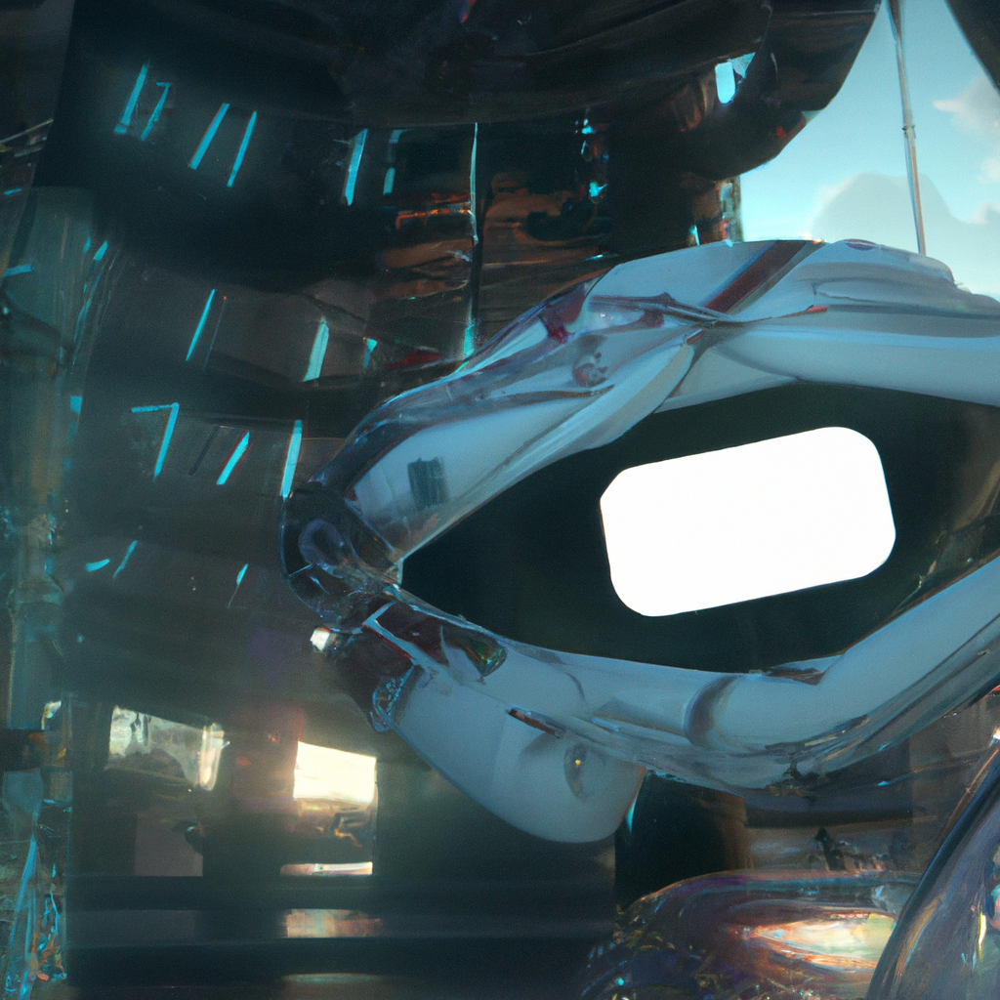

---

---

# linear **regression** 

$$

f_{w,b}(x) = wx + b

$$

w , b > parameters , weight
x > single feature

---

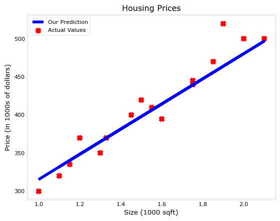

# Cost function 

$$J(w,b) = \frac{1}{2m} \sum\limits_{i = 0}^{m-1} (f_{w,b}(x^{(i)}) - y^{(i)})^2$$ 

where

$$yHat = f_{w,b}(x^{(i)}) = wx^{(i)} + b $$

m = number of example

---

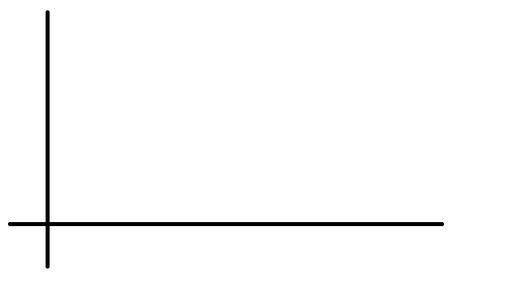

# Example 
###### **choose w to minimize J(w)**

$$yHat = f_{w}(x^{(i)}) = wx^{(i)} $$

$$J(w) = \frac{1}{2m} \sum\limits_{i = 0}^{m-1} (f_{w}(x^{(i)}) - y^{(i)})^2$$ 

---

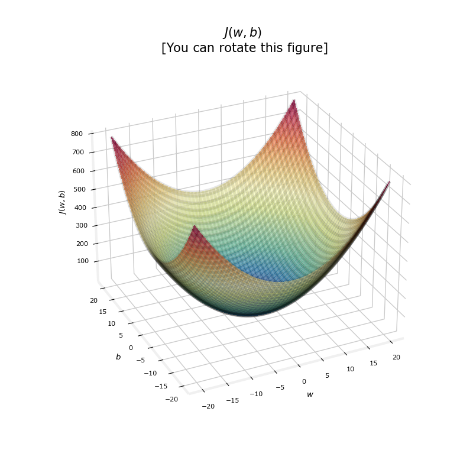

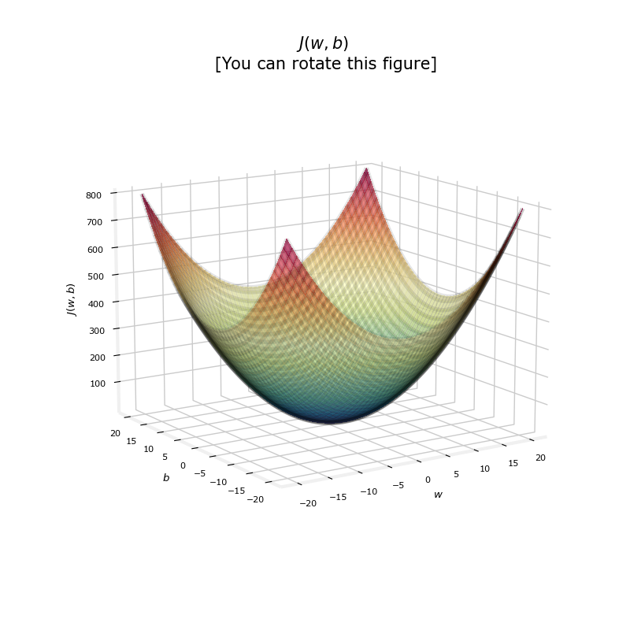

---

# Gradient descent 
#### **a more systematic way to minimize j(w,b)**

$$
\newline

\begin{align*} \text{repeat}&\text{ until convergence:} \; \lbrace \newline
\;  w &= w -  \alpha \frac{\partial }{\partial w} J(w,b)  \; \newline \newline
 b &= b -  \alpha \frac{\partial }{\partial b} J(w,b) \newline \rbrace
\end{align*}$$

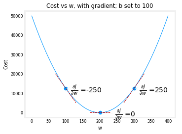

---

# **Derivative** of the Cost func

$$J(w,b) = \frac{1}{2m} \sum\limits_{i = 0}^{m-1} (f_{w,b}(x^{(i)}) - y^{(i)})^2$$

$$
\begin{align}
\frac{\partial }{\partial w}J(w,b)  &= \frac{1}{m} \sum\limits_{i = 0}^{m-1} (f_{w,b}(x^{(i)}) - y^{(i)})x^{(i)} \\
  \frac{\partial }{\partial b}J(w,b)  &= \frac{1}{m} \sum\limits_{i = 0}^{m-1} (f_{w,b}(x^{(i)}) - y^{(i)}) \\
\end{align}
$$

<!-- 
_class: invert

-->

----

# optional

##### if **alpha** is too small :
##### if **alpha** is too big :

$$\alpha \frac{\partial }{\partial w} J(w,b)$$

###### calculate **Derivative** : ☻

---
## Lets get our hands dirty

* step 1
    * read our data
* step 2
    * write our functions
        * calculate yHat
        * calculate cost
        * calculate gradient
        * implement gradient descent
* step 3
    * congratulations

